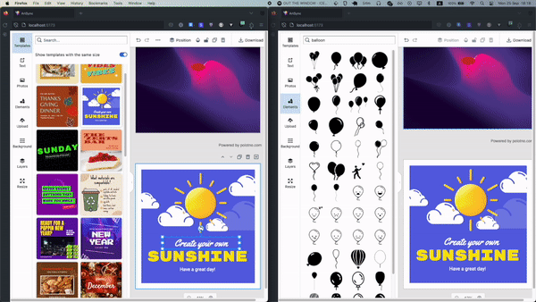

# PhotoCollab 🎨

Real-Time, Collaborative Photo Editor



## Local Development

- Clone the repo
  - `git clone https://github.com/rasjonell/PhotoCollab`
- Copy `.env.example` into `.env` and configure your environment
  ```bash
  echo """
  VITE_POLOTNO_KEY=<YOUR_POLOTNO_KEY>
  VITE_PARTYKIT_HOST=<YOUT_PARTYKIT_HOST>
  """ > .env
  ```
- Install the deps
  - `npm install`
- Run PartyKit Server
  - `npm run partykit:dev`
- Run the client
  - `npm run dev`

# Deployment

- Compile the project
  - `npm run build`
- Deploy PartyKit Server
  - `npm run partykit:deploy` you can also provide your own name for the project: `npm run partykit:deploy -- ./party/index.ts --name <YOUR_SERVER_NAME>`
